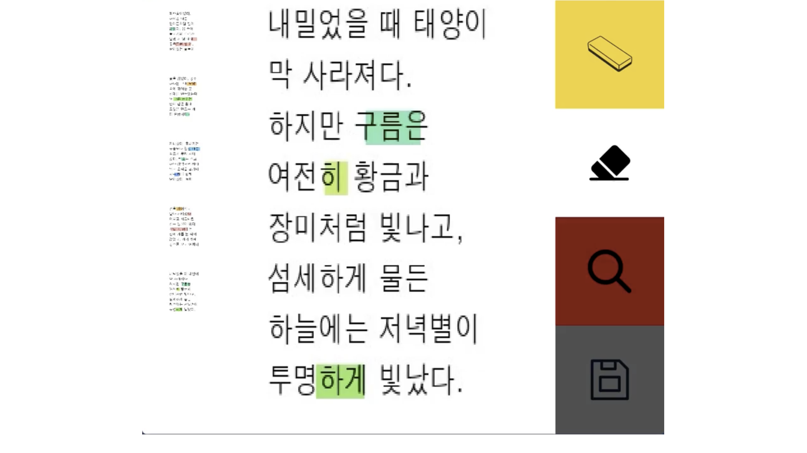
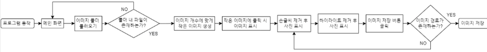
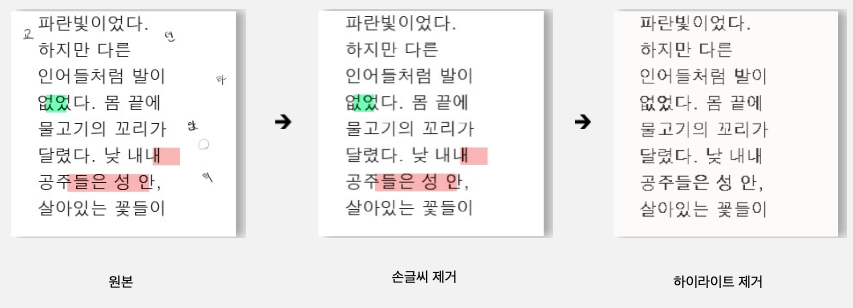

# RedoPaper

## 목차
1. [프로젝트 소개](#프로젝트-소개)
2. [프로젝트 목표](#프로젝트-목표)
3. [기능 설명](#기능-설명)
4. [사용 기술 및 구현 방식](#사용-기술-및-구현-방식)
5. [결과 및 한계점](#결과-및-한계점)
6. [개선사항](#개선사항)

## 프로젝트 소개
RedoPaper는 공용 문서에 존재하는 타인의 필기로 인한 불편함을 해소하고, 필기로 인해 읽기 어려워진 문서를 원본 문서로 복원하는 프로젝트입니다. 
많은 경우에 필기체는 읽기 어렵거나 지나치게 축약된 표현으로 이해하기 어려운 상황을 만듭니다. RedoPaper는 이런 문제를 해결하기 위해 만들어졌습니다.

## 프로젝트 목표
- 문제집에 작성한 필기 제거, 원본의 출처를 알 수 없는 문서를 원본 문서로 복원
- 학습 보조 도구 
- 문서로 된 문화유산 복원 사업 활용

## 기능 설명
- 손글씨 및 하이라이트 제거

## FlowChart 

## 사용 기술 및 구현 방식

- **PyTorch**: Python 기반의 오픈소스 머신러닝 라이브러리. 유연하고 빠른 딥러닝 연구 플랫폼으로 TLGAN Deep Learning Model의 학습 및 추론에 활용.
- **Docker**: Linux Container 기반의 오픈소스 가상화 플랫폼. DL Model 학습 환경 구성에 필요.
- **OpenCV**: Intel사가 개발한 실시간 컴퓨터 비전 라이브러리. 이미지 로드, 하이라이트 제거 등의 이미지 처리 작업에 사용.
- **Computer Vision**: 인공지능의 한 분야로, 사람이나 동물의 시각 체계를 컴퓨터에 구현. Deep Learning Model 학습 과정에서 문서의 텍스트 영역 검출에 사용.
- **TLGAN**: Robust Reading Challenge on Scanned Receipts OCR and Information Extraction (SROIE) 대회 우승 모델. 영수증 등의 출력물에서 텍스트 영역 예측에 사용되며, SuperResolution-GAN의 아이디어를 적용. 출력물의 텍스트 영역을 예측하여 추출하는데 사용됨.

## 결과

- RedoPaper는 원본 문서에서 손글씨와 하이라이트를 순차적으로 제거합니다
- 손글씨만 제거된 문서를 원하면 해당 단계에서 save하여 저장할 수 있습니다.

## 한계
- DL Model은 확률을 기반으로 동작하기 때문에 완벽하게 text영역을 추출하기 어려울 수 있으며, 특정 문서에서는 출력물 영역이 일부 지워지는 경우가 발생할 수 있습니다.

## 개선사항
- Eraser 기능 다양화: 현재는 모델을 통해 손글씨를 제거한 후 highlight를 제거하는 기능을 개별적으로 구현하고 있습니다. 이를 응용하여 손글씨를 제거하지 않으면서 highlight만을 지울 수 있도록 기능을 구현할 예정입니다.
- 문서 정렬 기능: 문서 내의 페이지 번호를 인식하여 프로그램 실행 시 자동적으로 문서를 페이지 번호대로 정렬해주는 기능을 추가할 예정입니다.
